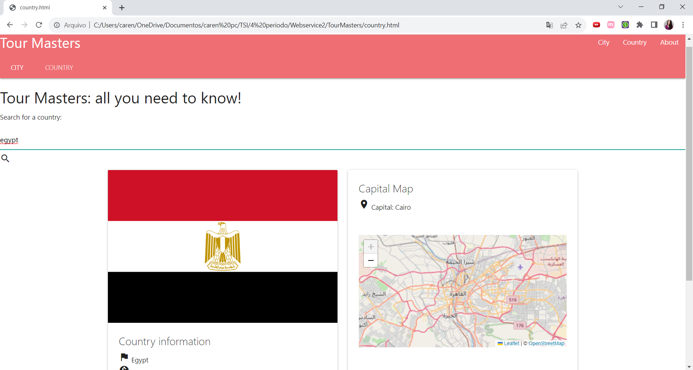
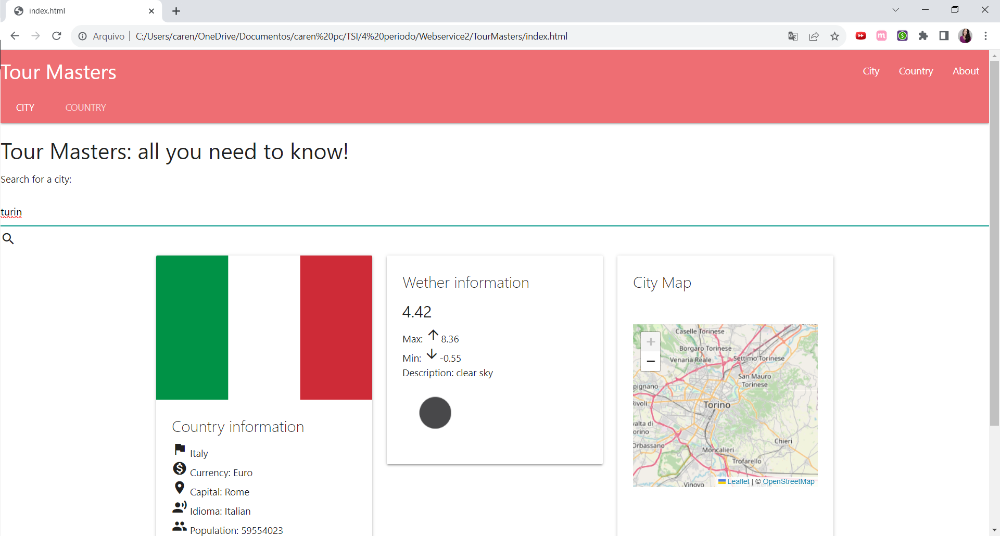

# TourMaster
Trabalho desenvolvido para a disciplina de webservices.
## Tour Master
Projeto criado com o intuito de auxiliar pessoas com interesse de viajar para outras cidades e outros países, fornecendo informações básicas a respeito do país, como seu idioma, moeda, população, além de um mapa da cidade buscada.
## Implemetação
Para implementar o projeto foram usadas as seguintes API's:
* [API Ninja - City](https://api-ninjas.com/api/city)
* [API Ninja - Country](https://api-ninjas.com/api/country)
* [REST Countries](https://restcountries.com/) - versões 2 e 3.1
* [OpenWetherMap](https://openweathermap.org/api)
* [OpenStreetMap](https://www.openstreetmap.org/)

Usando apenas HTML, CSS e JavaScript as requisições foram feitas as API's e por meio delas obtidas informações a respeito dos países e cidades buscados, além de informações sobre clipa e o mapa da cidade. 

## Execução
A execução é simples visto que o projeto é um webapp que utiliza apenas JavaScript, CSS e HTML, basta baixar o repositório e abrir o arquivo index.html em seu navegador como mostram as imagens abaixo:

## Vídeo

